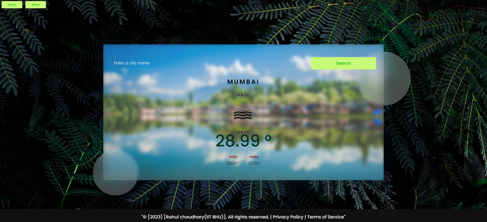

# description
 Welcome to our weather app! We provide up-to-date weather information for locations around the world.  With our app, you can:  Check current weather conditions, including temperature. Get accurate weather information. View weather information for multiple cities. Search for a city to get weather information. Whether you're planning a trip, organizing an outdoor event, or just curious about the weather, our app has got you covered!
# Weather App

This is a simple weather application that allows users to search for the current weather conditions in a specific city.

## Installation

1. Clone the repository: `git clone https://github.com/your-username/your-repo.git`
2. Install dependencies: `npm install`

## Usage

1. Open the index.html file in a web browser.
2. Enter a city name in the search input field.
3. Click the "Search" button to retrieve the weather information for the specified city.

## Technologies Used

- HTML
- CSS
- JavaScript

## API Key

This application requires an API key from OpenWeatherMap to fetch weather data. Make sure to replace the placeholder API key in the `key.js` file with your own valid API key.

## License

This project is licensed under the [MIT License](LICENSE).

